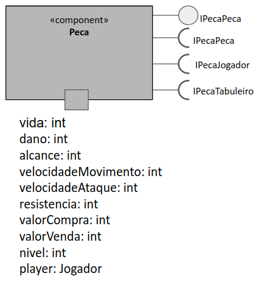
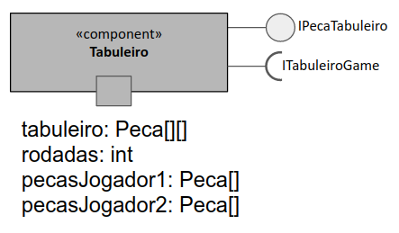
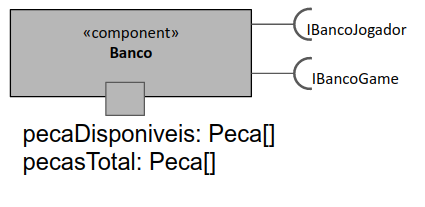
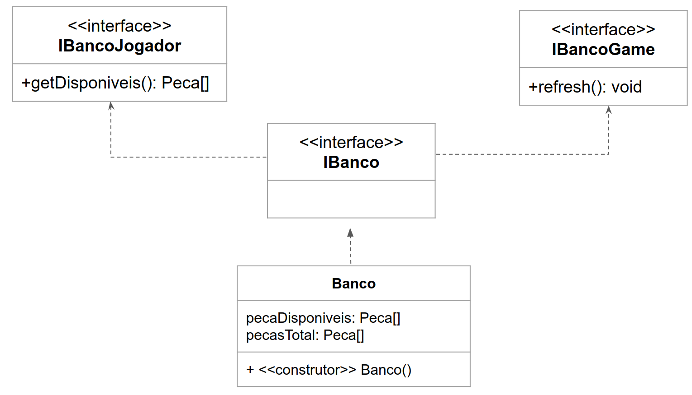
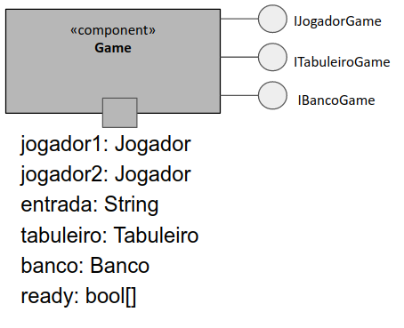

# Projeto Medium War

# Equipe
* Felipe Pacheco Manoel - 215743
* Cristiano Sampaio Pinheiro - 256352

# Descrição Resumida do Projeto
O projeto será um jogo em que cada jogador posicionará as peças de sua mão no tabuleiro e em seguida as peças atacarão as pecas do inimigo por meio de um determinado compartamento atribuído ao tipo da peça.

# Vídeo do Projeto
[Link do vídeo do projeto](https://drive.google.com/open?id=12WCLHbGfRfGYytHxSpNW-8KsJQpoNzBI)

# Diagrama Geral de Componentes

# Componente Jogador

## Interfaces

Interfaces associadas ao componente Jogador:

Campo | Valor
----- | -----
Classe | jogador.Jogador
Autores | Felipe Pacheco Manoel e Cristiano Sampaio Pinheiro
Objetivo | representar cada um dos jogadores e suas relações com os outros componenetes
Interface | 
~~~
public interface IJogadorGame {
    public void addPontos(){};
    public void comprarPeca(int id){};
    public void venderPeca(int id){};
    public void uparPeca(int id){};
    public void receberGold(int quantia){};
    public void colocarPeca(int id,String posicao){};
}

~~~

## Detalhamento das Interfaces

### Interface `<nome da interface>`
`<papel da interface>`.

Método | Objetivo
-------| --------
`<id do método em Java>` | `<objetivo do método e descrição dos parâmetros>`

# Componente Peca

## Interfaces

Interfaces associadas ao componente Peca:

Campo | Valor
----- | -----
Classe | peca.Peca
Autores | Felipe Pacheco Manoel e Cristiano Sampaio Pinheiro
Objetivo | representar cada uma das Pecas presentes no jogo
Interface | 
~~~
public interface IPecaJogador {
    private void upNivel(){};
    private int getPrecoVenda(){};

}
public interface IPecaPeca {
    public void receberDano(){};    
    public String getPosition(){};

}
public interface IPecaTabuleiro {
    public void moverOuAtacar(){};
    public String getPosition(){};

}
public interface IPecaJogador extends IPecaPeca,IPecaJogador,IPecaTabuleiro{};

~~~

## Detalhamento das Interfaces

### Interface `<nome da interface>`
`<papel da interface>`.

Método | Objetivo
-------| --------
`<id do método em Java>` | `<objetivo do método e descrição dos parâmetros>`
# Componente Tabuleiro

## Interfaces

Interfaces associadas ao componente Tabuleiro:

Campo | Valor
----- | -----
Classe | tabuleiro.Tabuleiro
Autores | Felipe Pacheco Manoel e Cristiano Sampaio Pinheiro
Objetivo | representar o tabuleiro do jogo
Interface | 
~~~
public interface ITabuleiroGame {
    public void acionarPecas(){};
    public int getQuantia(String quantia){};

}
public interface ITabuleiroPeca {
    public void setPeca(String posicao){};
    public Peca getPeca(String posicao){};
    public Peca[] getPecas(String jogador){};
    public  void eliminarPeca(String posicao){};

}
public interface ITabuleiro extends ITabuleiroGame,ITabuleiroPeca {}

~~~

## Detalhamento das Interfaces

### Interface ITabuleiroGame
Permite que Game acione(movimentar e atacar) as peças do tabuleiro e de pegar informacões da rodada referentes a quantias que os jogadores irão receber.

Método | Objetivo
-------| --------
acionarPecas | realiza a interação entre as peças
getQuantia |  recebe uma string que representa um jogador e retorna a quantia inteira que o jogador representado pela String receberá ao final de uma rodada

### Interface ITabuleiroPeca
Permite que as peças interajam entre si.

Método | Objetivo
-------| --------
setPeca | recebe uma String e um objeto da classe Peca e coloca a peça recebida na posição representada pela String
getPeca | recebe uma String e recupera a peça na posição representada pela String
eliminarPeca | recebe uma String e exclui a peça na posição representada pela string passada como parâmetro
getPecas | Recebe uma String que representa um jogador e retorna um vetor de pecas que contém as pecas do jogador ,recebido como parâmetro, que estão no tabuleiro
# Componente Banco

## Interfaces

Interfaces associadas ao componente Banco:

Campo | Valor
----- | -----
Classe | banco.Banco
Autores | Felipe Pacheco Manoel e Cristiano Sampaio Pinheiro
Objetivo | representar o tabuleiro do jogo
Interface | 
~~~
public interface IBancoGame {
    public Peca[] getDisponiveis(){};

}
public interface IBancoJogador {
    public void refresh(){};

}
public interface IBanco extends IBancoGame,IBancoJogador {}

~~~

## Detalhamento das Interfaces

### Interface IBancoJogador
Permite que o jogador acesse as peças dissponíveis para a compra.

Método | Objetivo
-------| --------
getDisponiveis | retorna um vetor de peças disponíveis para a compra
refresh | atualiza o vetor de peças disponíveis (trocando as peças que estarão disponíveis)
# Componente Game

Campo | Valor
----- | -----
Classe | game.Game
Autores | Felipe Pacheco Manoel e Cristiano Sampaio Pinheiro
Objetivo | representar a classe que vai rodar o jogo
Interface | ausente

