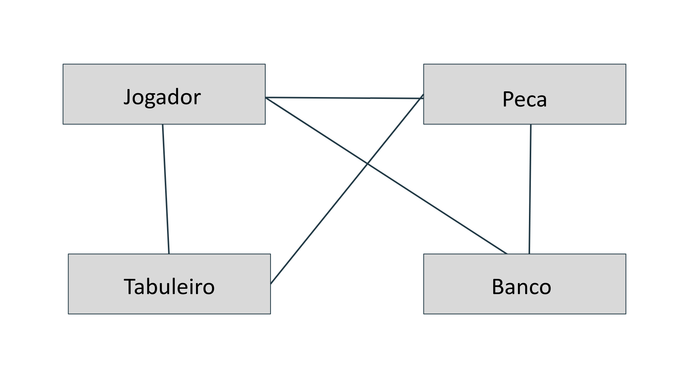
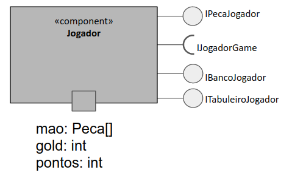

# Projeto Medium War

# Equipe
* Felipe Pacheco Manoel - 215743
* Cristiano Sampaio Pinheiro - 256352

# Descrição Resumida do Projeto
O projeto será um jogo em que cada jogador posicionará as peças de sua mão no tabuleiro e em seguida as peças atacarão as pecas do inimigo por meio de um determinado compartamento atribuído ao tipo da peça.

# Vídeo do Projeto
[Link do vídeo do projeto](https://drive.google.com/open?id=12WCLHbGfRfGYytHxSpNW-8KsJQpoNzBI)

# Diagrama Geral de Componentes

# Componente Jogador

## Interfaces

Interfaces associadas ao componente Jogador:

Campo | Valor
----- | -----
Classe | jogador.Jogador
Autores | Felipe Pacheco Manoel e Cristiano Sampaio Pinheiro
Objetivo | representar cada um dos jogadores e suas relações com os outros componenetes
Interface | ~~~
public interface IJogadorGame {
 public void addPontos(){};
public void comprarPeca(int id){};
public void venderPeca(int id){};
public void uparPeca(int id){};
public void receberGold(int quantia){};
public void colocarPeca(int id,String posicao){};
}

~~~

## Detalhamento das Interfaces

### Interface `<nome da interface>`
`<papel da interface>`.

Método | Objetivo
-------| --------
`<id do método em Java>` | `<objetivo do método e descrição dos parâmetros>`

## Exemplo:

### Interface `ITableProducer`

Interface provida por qualquer fonte de dados que os forneça na forma de uma tabela.

Método | Objetivo
-------| --------
`requestAttributes` | Retorna um vetor com o nome de todos os atributos (colunas) da tabela.
`requestInstances` | Retorna uma matriz em que cada linha representa uma instância e cada coluna o valor do respectivo atributo (a ordem dos atributos é a mesma daquela fornecida por `requestAttributes`.

### Interface `IDataSetProperties`

Define o recurso (usualmente o caminho para um arquivo em disco) que é a fonte de dados.

Método | Objetivo
-------| --------
`getDataSource` | Retorna o caminho da fonte de dados.
`setDataSource` | Define o caminho da fonte de dados, informado através do parâmetro `dataSource`.
