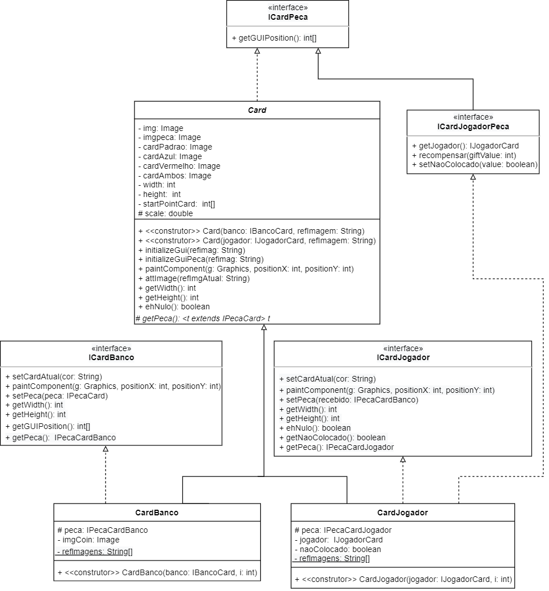
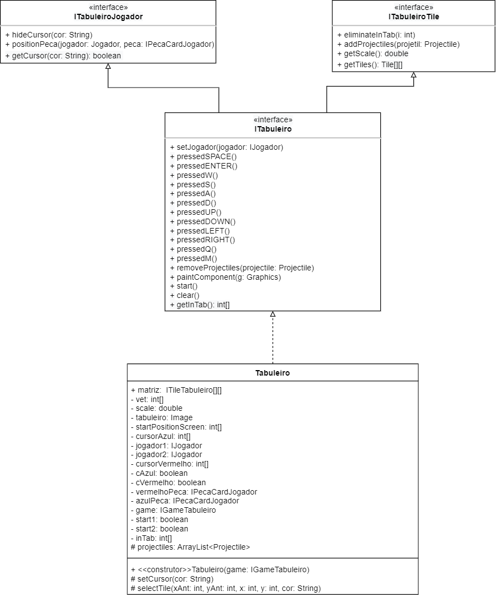

# Projeto Medium War

# Equipe
* Felipe Pacheco Manoel - 215743
* Cristiano Sampaio Pinheiro - 256352

# Descrição Resumida do Projeto
O projeto será um jogo em que cada jogador posicionará as peças de sua mão no tabuleiro e em seguida as peças atacarão as peças do inimigo por meio de um determinado compartamento atribuído ao tipo da peça. Cada peça terá atributos específicos como vida , dano e alcance de ataque. A temática do jogo será baseada em classes e criaturas de um RPG.

# Vídeos do Projeto
[Link do vídeo do projeto](https://drive.google.com/open?id=12WCLHbGfRfGYytHxSpNW-8KsJQpoNzBI)

# Slides do Projeto
[Link para apresentação do projeto](https://drive.google.com/open?id=1aigs8xozY3tbv9r1LsFobk-ZYNi4p2eJKla_YFFc_GY)

# Detalhes do Código

## Criação e gerenciamento do menu usando cardLayout
~~~
public Menu(Window window){
		...
		setMenu();
		//Cria cardLayout e adiciona janelas
		cardLayout = new CardLayout();
		this.setLayout(cardLayout);
		this.add(menuPage, "home");
		this.add(creditsPage, "credits");
		setVisible(true);
	}
	public void setMenu() {
		...
		//Cria Janelas
		menuPage = new JLabel();
		menuPage.setLayout(null);
		menuPage.setIcon(imgMenu);
		menuPage.setVisible(false);
		...
		//Cria Botoes
		play=new JButton(imgPlay);
		play.setBounds(1400, 400, 432, 144);
		play.addActionListener(window);
		menuPage.add(play);
		...
	}
~~~
~~~
public Window(int width,int height,String title,Game game) {
		...
		menu = new Menu(this);
		...
		frame.add(menu);
	}
	 public void actionPerformed(ActionEvent evento) {
		 	//Cria a janela principal
		 	principal=new JPanel();
			principal.setOpaque(false);
			principal.setLayout(null);
			principal.setVisible(true);
			...
			//Janela principal adiciona o game
			principal.add(game);
			//Janela principal e adicionada ao cardLayout do menu 
			menu.add(principal,"principal");
			menu.cardLayout.show(menu,"principal");
		 	
		 	game.gameStart();
		 	game.start(); 	
	}
	 public void endGame() {
		endHome.setVisible(true);
		SwingUtilities.updateComponentTreeUI(this);
	}
	 public void setMenu() {
		game.stop();
		menu.cardLayout.show(menu,"home");
	}
~~~
## Controle da movimentação da peça
~~~
public void moveOrAttack() {
	...
	for(int i=0;i<matriz.length;i++) {
		for(int j=0;j<matriz[0].length;j++) {
			if(matriz[i][j].existsPeca()&&matriz[i][j].getPeca().getCor()!=this.cor&&Tile.dist(matriz[i][j], tile)<dist) {//achar menor distncia a peca inimiga
				dist=Tile.dist(matriz[i][j], tile);
				alvo=matriz[i][j];
			}
		}
	}
	if(dist<=alcance&&dist!=100) {
		currentAction="attacking";
		...
	}
	else if(dist!=100) {
		try {
			direction=chooseDirection(alvo,tried);
			lastPosition=new int[2];
			lastPosition[0]=-direction[0];
			lastPosition[1]=-direction[1];
			
			moveTarget=tile.getOtherTiles()[tile.getPosition()[0]+direction[0]][tile.getPosition()[1]+direction[1]];
			
			attackTarget=null;
			tried=new ArrayList<int[]>();//atualiza o vetor das direcoes que ja foram testadas no chooseDirection() que o utilizara para fazer novas tentativas
			tried.add(lastPosition);
			currentAction="moving";
			...
		} catch (FormatoInvalido e) {
			System.out.println("formato invalido");
		}catch (MovimentoInvalido e) {
			if(tried.size()<4) {
				moveOrAttack();
			}
			else {
				esperando=true;//tenta de novo no proximo tick
				tried=new ArrayList<int[]>();
				if(lastPosition!=null)tried.add(lastPosition);
			}
			
		}
		
	}
}
~~~	
## Diferentes maneiras de instanciar uma peça
~~~
public Peca(double scale) {
	this.scale=scale;
}
public Peca(IPecaCardJogador peca,Tile tile) {
	set(peca);//atribui as variaveis que toda peca devera ter a partir de uma instancia anterior e copia os atributos para a nova peca
	this.tile=tile;
	inBoard=true;
	basePosition=tile.getGUIPosition();
	origem=peca;
	peca.getCard().setNaoColocado(false);
	int[] start=new int[2];
	start[0]=(int)(getCenterPosition()[0]+correction[0]*scale+scale*translation[0]);
	start[1]=(int)(basePosition[1]+scale*correction[1]+scale*translation[1]);
	barraDeVida=new BarraDeVida(start,scale,cor);
}
public Peca(IPeca peca,ICardBanco card) {
	set(peca);		
	inBoard=false;
	basePosition=card.getGUIPosition();
}
public Peca(IPecaCardBanco peca,ICardJogadorPeca card) {
	set(peca);		
	inBoard=false;
	basePosition=card.getGUIPosition();
	this.card=card;
	cor=card.getJogador().getCor();
}
~~~
# Diagrama Geral do Projeto

## Comandos de cada jogador

# Diagrama Geral de Componentes

# Componente Jogador

## Interfaces

Interfaces associadas ao componente Jogador:

Campo | Valor
----- | -----
Classe | jogador.Jogador
Autores | Felipe Pacheco Manoel e Cristiano Sampaio Pinheiro
Objetivo | representar cada um dos jogadores e suas relações com os outros componenetes
Interface | 
~~~
public interface IJogador extends IJogadorCard, IJogadorBanco{
	public void addPoint();
	public int getPoints();
	public int obtainCursor();
	public void hideCursor();
	
	public void pressedA() ;
	public void pressedC() ;
	public void pressedVIRGULA();
	public void pressedD() ;
	public void pressedLEFT();
	public void pressedRIGHT();
	public void pressedZ() ;
	public void pressedE();
	public void pressedX();
	public void pressedDoisPontos();
	public void pressedPONTO() ;
	public void pressedBARRA() ;
	public void pressedSPACE() ;
	public void pressedENTER() ;
	public void paintComponent(Graphics g);	

}
public interface IJogadorBanco {
	void receber(IPecaCardBanco peca);
	public int getCash();
	public void addCash(int valor);
}
public interface IJogadorCard {
	public double getScale();

	public String getCor();

	public void addCash(int value);
}

~~~

## Detalhamento das Interfaces

### Interface IJogador
Essa interface é responsável por agrupar as demais interfaces assim como estabelever a relação entre o jogador e o game

Método | Objetivo
-------| --------
addPoint | Incrementa a pontuação do jogador que ganhou a rodada
getPoints | Retorna quantos pontos de terminado jogador possui
hideCursor | Faz com que o cursor não seja mais visível
paintComponent |Imprime a mão do jogador e as suas peças armazenadas
pressedA | Movimenta o cursor da mão do jogador 1 para a esquerda
pressedD | Movimenta o cursor da mão do jogador 1 para a direita
pressedLEFT | Movimenta o cursor da mão do jogador 2 para a esquerda
pressedRIGHT | Movimenta o cursor da mão do jogador 2 para a direita
pressedC | Notifica o banco que o jogador 1 quer comprar uma peça
pressedVIRGULA | Notifica o banco que o jogador 2 quer comprar uma peça
pressedX | Coloca o cursor na mão do jogador 1 para escolher uma peça para posicioná-la e em seguida notifica o tabuleiro que o jogador 1 quer posicionar uma peça 
pressedPONTO | Coloca o cursor na mão do jogador 2 para escolher uma peça para posicioná-la e em seguida notifica o tabuleiro que o jogador 2 quer posicionar uma peça 
pressedZ | Coloca o cursor na mão do jogador 1 para escolher uma peça para vendê-la e em seguida a remove da mão e incrementa o dinheiro do jogador 1
pressedBARRA | Coloca o cursor na mão do jogador 2 para escolher uma peça para vendê-la e em seguida a remove da mão e incrementa o dinheiro do jogador 2
pressedE | Liga ou desliga a exibição dos atributos da peça do jogador 1
pressedDoisPontos | Liga ou desliga a exibição dos atributos da peça do jogador 2
pressedSPACE | Confirma a escolha do jogador 1 de qual peça será vendida ou posicionada
pressedENTER | Confirma a escolha do jogador 2 de qual peça será vendida ou posicionada

###Interface IJogadorBanco
Essa interface é responsável por representar as interações do banco no jogador
Método | Objetivo
-------| --------
receber | O banco passa a peça escolhida pelo jogador para o jogador
getCash | Retorna o dinheiro que o jogador possui 
addCash | Incrementa ou decrementa o dinheiro de um jogador a partir de um valor passado como parâmetro

###Interface IJogadorCard
Essa interface é responsável por representar as interações do card com o jogador
Método | Objetivo
-------| --------
getScale | Retorna a escala da imagem 
getCor | Retorna a cor que representa o jogador 
addCash | Incrementa ou decrementa o dinheiro de um jogador a partir de um valor passado como parâmetro

# Componente Card

## Interfaces

Interfaces associadas ao componente Card:

Campo | Valor
----- | -----
Classe | card.Card
Autores | Felipe Pacheco Manoel e Cristiano Sampaio Pinheiro
Objetivo | representar cada um dos cards presentes no banco e na mao do jogador
Interface | 
~~~
public interface ICardJogadorPeca extends ICardPeca{

	

	public IJogadorCard getJogador();

	public void recompensar(int giftValue);

	public void setNaoColocado(boolean value);
	
}
public interface ICardPeca {
	public int[] getGUIPosition();
}
public interface ICardJogador {
	public int getWidth();
	public void paintComponent(Graphics g, int positionX, int positionY);
	public int getHeight();
	public boolean ehNulo();
	public void setCardAtual(String cor);
	public void setPeca(IPecaCardBanco recebido);
	public IPecaCardJogador getPeca();
	public boolean getNaoColocado();
	
}
public interface ICardBanco {
	public void setCardAtual(String cor);
	public void paintComponent(Graphics g, int positionX, int positionY);
	public void setPeca(IPecaCard peca);
	public IPecaCardBanco getPeca();
	public int getWidth();
	public int getHeight();
	public int[] getGUIPosition();
}

~~~

## Detalhamento das Interfaces

### Interface ICardPeca
Essa interface é responsável pela interação da peça com um card genérico

Método | Objetivo
-------| --------
getGUIPosition | Retorna a posição do card na tela

### Interface ICardJogadorPeca
Essa interface é responsável pela interação da peça com o card da mão do jogador

Método | Objetivo
-------| --------
getJogador | Retorna o jogador o qual o card pertence
recompensar | Notifica o card que uma peca irá recompensar o jogador com uma quantia passada como parâmetro
setNaoColocado | Recebe um boolean e o coloca na variavel naoColocado que diz se o card ja foi posicionado no tabuleiro

### Interface ICardBanco
Essa interface é responsável pela interação do banco com o card do banco

Método | Objetivo
-------| --------
getWidth | Retorna a largura da imagem do card
getHeight | retorna a altura da imagem do card
paintComponent | Imprime o card e seu conteúdo na tela passando a posição no banco como parâmetro
setCardAtual | Atualiza a imagem do card para refletir na posição do cursor
setPeca | Armazena uma cópia da peça passada como parâmetro
getPeca | Retorna a peça armazenada
getGUIPosition | Retona a posição do card na tela

### Interface ICardJogador
Essa interface é responsável pela interação do jogador com o card na mão do jogador

Método | Objetivo
-------| --------
getWidth | Retorna a largura da imagem do card
getHeight | retorna a altura da imagem do card
paintComponent | Imprime o card e seu conteúdo na tela passando a posição na mão como parâmetro
ehNulo | Verifica se o card está armazenando uma peça
setCardAtual | Atualiza a imagem do card para refletir na posição do cursor
setPeca | Armazena uma cópia da peça passada como parâmetro
getPeca | Retorna a peça armazenada
getNaoColocado | Retona a variável naoColocado que indica se o card ja foi posicionado no tabuleiro

# Componente Peca

## Interfaces

Interfaces associadas ao componente Peca:

Campo | Valor
----- | -----
Classe | peca.Peca
Autores | Felipe Pacheco Manoel e Cristiano Sampaio Pinheiro
Objetivo | representar cada uma das Pecas presentes no jogo
Interface | 
~~~
public interface IPeca {
	public void paintComponent(Graphics g, int positionX, int positionY);	
	public Image[] getAnimationFramesAttack();
	public Image[] getAnimationFramesMove();
	public Image[] getCurrentAnimation();
	public double getScale();
	public int getBaseMoveAnimDuration();
	public double getSpeed();
	public double getLife();
	public double getEndurance();
	public double getAttackSpeed();
	public double getAttackDamage();
	public int getBaseAttackAnimDuration();
	public double getAlcance();
	public String getCor();
	public int getPurchaseValue();
	public int getSaleValue();
	public int getGiftValue();
}
public interface IPecaCard extends IPeca{

	void printFeature(Graphics g, String string);

	void paintComponent(Graphics g);

}
public interface IPecaCardBanco extends IPecaCard{
	
}
public interface IPecaCardJogador extends IPecaCard {

	public ICardJogadorPeca getCard();

	public void recompensar(int giftValue);

	
	
}
public interface IPecaTile extends IPeca{
	public void moveOrAttack() ;
	public void setTarget(Tile tile);
	public void flip();
	public boolean getInBoard();
	public IJogadorCard getJogador();
	public ITilePeca getTile();
	
	public double[] getCenterPosition();
	public void setTargetNull();
	public boolean getMorto();
	public void receberDano(double attackDamage, Peca peca);
	public void receberDanoRanged(double dano,Projectile projetil);
	public ICardJogadorPeca getCard();
	public IPecaCardJogador getOrigem();
	public void setInBoard(boolean inBoard);
}

~~~

## Detalhamento das Interfaces

### Interface IPeca
Essa interface abriga os métodos genericos da peca e é herdada pelas demais interfaces.

Método | Objetivo
-------| --------
paintComponent | Imprime a peca corrigindo sua posição
getAnimationFramesAttack | Retorna o vetor de imagens da animação de ataque
getAnimationFramesMove | Retorna o vetor de imagens da animação de movimento
getCurrentAnimation | Retorna o vetor de imagens da animação que esta sendo executada no momento
getScale | Retorna a escala da imagem usada nas peças
getBaseMoveAnimDuration | Retorna a duração da animação de movimento da peça
getSpeed | Retorna a velocidade de movimentação da peça
getLife | Retorna a vida atual da peça
getEndurance | Retorna o valor da defesa da peça
getAttackSpeed | Retorna a velocidade de ataque da peça
getAttackDamage | Retorna o valor do dano causado pela peça
getBaseAttackAnimDuration | Retorna a duração da animação de ataque da peça
getAlcance | Retorna o alcance de ataque da peça
getCor | Retorna a cor do jogador a qual uma determinada peça pertence
getPurchaseValue | Retorna o valor de compra da peça
getSaleValue | Retorna o valor de venda da peça
getGiftValue | Retorna o valor acrescida ao oponente quando derrotar a peça

### Interface IPecaCard
Essa interface e responsável pela interação entre as peças e os cards.

Método | Objetivo
-------| --------
printFeature | Imprime os valores dos principais atributos da peca
paintComponent | Imprime a peca dentro do card

### Interface IPecaCardJogador
Essa interface e responsável pela interação entre a peca e os cards do jogador.

Método | Objetivo
-------| --------
getCard | Retorna o card o qual a peça esta inserida
recompensar | Retorna o valor acrescido quando a peça e derrotada

### Interface IPecaCardBanco
Essa interface e responsável pela interação entre a peca e os cards do banco.

### Interface IPecaTile
Essa interface e responsável pela interação entre as peças e os tiles presentes no tabuleiro.

Método | Objetivo
-------| --------
moveOrAttack | Verifica qual ação a peça deve tomar, mover ou atacar
setTarget | Define para qual tile a peça deve se mover
flip | Espelha imagem da peça
getInBoard | Retorna se a peça esta no tabuleiro
getJogador | Retorna o jogador dono da peça
getTile | Retorna o tile que a peça esta ocupando no momento
getCenterPosition | Retorna a posição central da peça no frame
setTargetNull | Define como nulo o próximo tile que a peça deve assumir
getMorto | Retorna se peça esta viva ou morta
receberDano | Aplica dano a peça causado por um ataque próximo
receberDanoRanged | Aplica dano a peça causado por um ataque a distância 
getCard | Retorna o card o qual a peça pertence
getOrigem | Retorna a peca que esta presente no card
setInBoard | Define se a peça esta ou não no tabuleiro

# Componente Tabuleiro

## Interfaces

Interfaces associadas ao componente Tabuleiro:

Campo | Valor
----- | -----
Classe | tabuleiro.Tabuleiro
Autores | Felipe Pacheco Manoel e Cristiano Sampaio Pinheiro
Objetivo | representar o tabuleiro do jogo
Interface | 
~~~
public interface ITabuleiro extends ITabuleiroTile,ITabuleiroJogador {

	public void setJogador(IJogador jogador1);

	public void pressedSPACE();
	public void pressedENTER() ;
	public void pressedW() ;
	public void pressedS() ;
	public void pressedA() ;
	public void pressedD() ;
	public void pressedUP() ;
	public void pressedDOWN();
	public void pressedLEFT() ;
	public void pressedRIGHT() ;
	public void pressedQ();
	public void pressedAspas();

	public void removeProjectiles(Projectile projectile);
	public void paintComponent(Graphics g);
	
	public void start();
	public void clear();
}
public interface ITabuleiroJogador {

	public boolean getCursor(String cor);

	public void hideCursor(String cor);

	public void positionPeca(Jogador jogador, IPecaCardJogador peca);

}
public interface ITabuleiroTile  {
	public double getScale();
	public Tile[][] getTiles();
	public void eliminateInTab(int i);
	public void addProjectiles(Projectile projetil);
}

~~~

## Detalhamento das Interfaces

### Interface ITabuleiro
Essa interface é responsável por agrupar as outras inrfeces de tabuleiro e de fazer as interações entre o game e o tabuleiro e entre os projéteis e o tabuleiro

Método | Objetivo
-------| --------
setJogador | Conecta um jogador com o tabuleiro
removeProjectiles | Remove um determinado projetil do tabuleiro
paintComponent | Imprime o tabuleiro ,os seus tiles(e consequentemente as peças armazenadas por eles) , e os projéteis na tela
start | Inicia a interação das peças
clear | Remove todas as peças do tabuleiro
pressedSPACE | Confirma o posicionamento da peça do jogador 1
pressedW | Move o cursor do jogador 1 para cima
pressedS | Move o cursor do jogador 1 para baixo
pressedA | Move o cursor do jogador 1 para a esquerda
pressedD | Move o cursor do jogador 1 para a direita
pressedQ | Notifica o banco que o jogador 1 terminou de posicionar suas peças
pressedENTER | Confirma o posicionamento da peça do jogador 2
pressedUP | Move o cursor do jogador 2 para cima
pressedDOWN | Move o cursor do jogador 2 para baixo
pressedLEFT | Move o cursor do jogador 2 para a esquerda
pressedRIGHT | Move o cursor do jogador 2 para a direita
pressedAspas | Notifica o banco que o jogador 2 terminou de posicionar suas peças

### Interface ITabuleiroJogador
Essa interface é responsável pela interação entre o jogaador e o tabuleiro

Método | Objetivo
-------| --------
getCursor | Retorna a posição do cursor que é representado pela cor passada como parâmetro
hideCursor | Faz com que o cursor de uma determinada cor não seja mais visível
posicionarPeca | Notifica o tabuleiro que um determinado jogador quer posicionar uma determinada peça , ambos passados como parâmetro

### Interface ITabuleiroJogador
Essa interface é responsável pela interação entre o jogaador e o tabuleiro

Método | Objetivo
-------| --------
getScale | Retorna a escala da imagem do tabuleiro
getTiles | Retorna uma matriz de tiles que represemta as posicoes do tabuleiro
eliminateInTab | Decrementa a variável que controla quantas peças cada joagdor tem no tabuleiro 
addProjectiles | Adiciona um projétil passado como parâmetro no tabuleiro

# Componente Tile

## Interfaces

Interfaces associadas ao componente Peca:

Campo | Valor
----- | -----
Classe | tabuleiro.Tile
Autores | Felipe Pacheco Manoel e Cristiano Sampaio Pinheiro
Objetivo | representar cada uma das posicoes do tabuleiro
Interface | 
~~~
public interface ITile extends ITileTabuleiro, ITilePeca{}
public interface ITilePeca {
	public Image getImage();

	public int[] getGUIPosition();
	public int[] getPosition();
	public Tile[][] getOtherTiles();
	public void setNull();
	public void setPeca(Peca peca);
	public void clearTile();
	public boolean existsPeca();
	public IPecaTile getPeca();
	public void eliminateTab(int i);
	public void setMarcado();
	public void addProjectile(Projectile projetil);
}
public interface ITileTabuleiro {
	public void paintComponent(Graphics g,Image img);

	public IPecaTile getPeca();
	public void paintPeca(Graphics g);
	public Image getImage();
	public void nullTarget();
	public void actionPeca();
	public boolean existsPeca();
	public void setTileAtual(String cor);
	public void setPeca(IPecaCardJogador peca);
	public void setNull();
}

~~~

## Detalhamento das Interfaces
### Interface ITile
Essa interface é responsável por agrupar as outras interfaces do tile
### Interface ITilePeca
Essa interface é responsável pela interação entre as peças e o tile.

Método | Objetivo
-------| --------
getImage | Retorna a imagem do tile
getGUIPosition | Retorna a posição do tile na tela
getOtherTiles | Retorna a matriz de tiles que representa as posições do tabuleiro
getPosition | Retorna a posição que o tile está na matriz de peças
setNull | Coloca o valor null na variável que  guarda a peça
setPeca | Guarda uma peça passada como parâmetro
clearTile | Remove a peça armazenada e retira a referência do tile existente na peça
existsPeca | Checa se o tile está ocupado por uma peça
getPeca | Retorna a peça armazenada
eliminateTab | Faz com que o tabuleiro decremente um a variável que guarda quantas peças um determinado jogador tem , passando um inteiro que representa o jogador
setMarcado | Alterna a variável marcado que indica que uma peça ja está se movimentando em direção à aquele tile
addProjectile | Adiciona um projétil passado como parâmetro no tabuleiro 

### Interface ITileTabuleiro
Essa interface e responsável pela interação entre o tabuleiro e o tile
Método | Objetivo
-------| --------
getPeca | Retorna a peça armazenada
paintPeca | Se estiver armazenada alguma peça , imprime a peça na tela
getImage | Retorna a imagem do tile
setNull | Coloca o valor null na variável que  guarda a peça
setPeca | Guarda uma peça passada como parâmetro
existsPeca | Checa se o tile está ocupado por uma peça
nullTarget | Para o movimento da peça anulando a variável que guarda o seu destino
actionPeca | Inicia as ações de movimento e ataque da peça
setTileAtual | Troca a imagem do tile que será imprimida para indicar que um cursor está no tile ou não

# Componente Banco

## Interfaces

Interfaces associadas ao componente Banco:

Campo | Valor
----- | -----
Classe | banco.Banco
Autores | Felipe Pacheco Manoel e Cristiano Sampaio Pinheiro
Objetivo | representar o tabuleiro do jogo
Interface | 
~~~
public interface IBanco extends IBancoCard,IBancoJogador {

	void setJogador(IJogador jogador1);
	public int obtainCursor(String cor);
	public void pressedLEFT();
	public void pressedRIGHT();
	public void pressedA();
	public void pressedD();
	public void pressedSPACE();
	public void pressedENTER();
	public void pressedE();
	public void pressedDoisPontos();
	public void refresh();
	public void paintComponent(Graphics g);
}

public interface IBancoCard {
	public double getScale();
}
public interface IBancoJogador {

	public void comprar(IJogador jogador);
			
	public void hideCursor(int i);

	public int obtainCursor(String cor);
}

~~~

## Detalhamento das Interfaces

### Interface IBanco
Essa interface é responsável por agrupar as outras interfaces e representar as interações entre o game e o banco

Método | Objetivo
-------| --------
hideCursor | Faz com que o cursor de determinado jogador(representado por uma cor) não seja mais visível
paintComponent |Imprime o banco e as suas peças armazenadas
pressedA | Movimenta o cursor do jogador 1 para a esquerda
pressedD | Movimenta o cursor do jogador 1 para a direita
pressedLEFT | Movimenta o cursor do jogador 2 para a esquerda
pressedRIGHT | Movimenta o cursor do jogador 2 para a direita
pressedE | Liga ou desliga a exibição dos atributos da peça do jogador 1
pressedDoisPontos | Liga ou desliga a exibição dos atributos da peça do jogador 2
pressedSPACE | Confirma a escolha do jogador 1 de qual peça será comprada
pressedENTER | Confirma a escolha do jogador 2 de qual peça será comprada
refresh | Troca as peças que estarão disponíveis para compra

### Inteface IBancoCard
Essa interface é responsável pela interação entre o card e o banco

Método | Objetivo
-------| --------
getScale | Retorna a escala da imagem do banco

### Interface IBancoJogador
Essa interface é responsável pela interação entre o jogador e o banco 

Método | Objetivo
-------| --------
obtainCursor | Retorna a posição do cursor de um jogador representado pela sua respectiva cor
hideCursor | Faz com que o cursor de determinado jogador(representado por uma cor) não seja mais visível
comprar | Notifica o banco que um determinado jogador deseja comprar um peça

# Componente Game

## Interfaces

Interfaces associadas ao componente Game:

Campo | Valor
----- | -----
Classe | game.Game
Autores | Felipe Pacheco Manoel e Cristiano Sampaio Pinheiro
Objetivo | representar a classe que vai rodar o jogo
Interface | 
~~~
public interface IGame {
	public double getScale();
}
public interface IGameTabuleiro extends IGame{
	public void newRound(String cor);
	public void endGame(String cor);
}
~~~
## Detalhamento das Interfaces

### Interface IGame
Permite que outras classes tenham acesso ao game

Método | Objetivo
-------| --------
getScale | Retorna a escala da imagem usada no frame principal

### Interface IGameTabuleiro
Permite que o tabuleiro crie novos rounds e finalize o jogo

Método | Objetivo
-------| --------
newRound | Realiza ações necessárias para iniciar um novo round
endGame | Encerra o jogo apresentando opção de retornar ao menu

# Plano de Exceções

## Diagrama da hierarquia de exceções

## Descrição das classes de exceção

Classe | Descrição
----- | -----
MovimentoInvalido | Engloba todas as exceções nas quais o movimento é inválido.
ForaDoTabuleiro | Indica que a posição pretendida não está dentro do tabuleiro.
PosicaoOcupada | Indica que a peça não pode se mover porque a posição pretendida ja está ocupada.
FormatoInvalido | Indica que a entrada do método de movimento é inválida.

