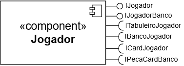
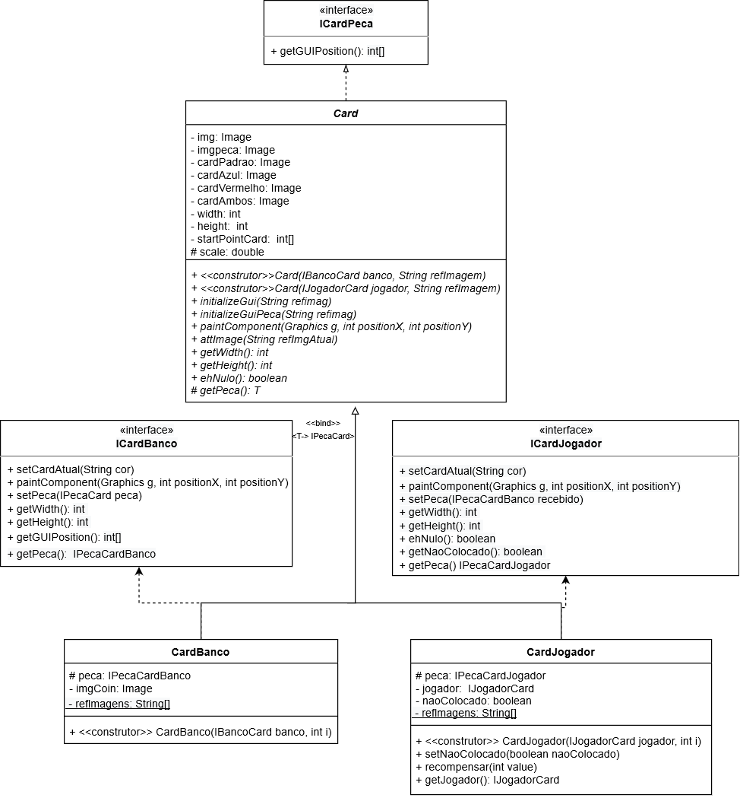

# Projeto Medium War

# Equipe
* Felipe Pacheco Manoel - 215743
* Cristiano Sampaio Pinheiro - 256352

# Descrição Resumida do Projeto
O projeto será um jogo em que cada jogador posicionará as peças de sua mão no tabuleiro e em seguida as peças atacarão as peças do inimigo por meio de um determinado compartamento atribuído ao tipo da peça. Cada peça terá atributos específicos como vida , dano e alcance de ataque. A temática do jogo será baseada em classes e criaturas de um RPG.

# Vídeo do Projeto
[Link do vídeo do projeto](https://drive.google.com/open?id=12WCLHbGfRfGYytHxSpNW-8KsJQpoNzBI)

# Apresentação do Projeto
[Link para apresentação do projeto](https://drive.google.com/open?id=1aigs8xozY3tbv9r1LsFobk-ZYNi4p2eJKla_YFFc_GY)

# Diagrama Geral de Componentes

# Componente Jogador

## Interfaces

Interfaces associadas ao componente Jogador:

Campo | Valor
----- | -----
Classe | jogador.Jogador
Autores | Felipe Pacheco Manoel e Cristiano Sampaio Pinheiro
Objetivo | representar cada um dos jogadores e suas relações com os outros componenetes
Interface | 
~~~
public interface IJogador extends IJogadorCard, IJogadorBanco{
	public void addPoint();
	public int getPoints();
	public int obtainCursor();
	public void hideCursor();
	
	public void pressedA() ;
	public void pressedC() ;
	public void pressedVIRGULA();
	public void pressedD() ;
	public void pressedLEFT();
	public void pressedRIGHT();
	public void pressedZ() ;
	public void pressedE();
	public void pressedX();
	public void pressedDoisPontos();
	public void pressedPONTO() ;
	public void pressedBARRA() ;
	public void pressedSPACE() ;
	public void pressedENTER() ;
	public void paintComponent(Graphics g);	

}
public interface IJogadorBanco {
	void receber(IPecaCardBanco peca);
	public int getCash();
	public void addCash(int valor);
}
public interface IJogadorCard {
	public double getScale();

	public String getCor();

	public void addCash(int value);
}

~~~

## Detalhamento das Interfaces

### Interface Jogador
Essa interface e responsável por gerenciar as ações dos jogares e sua interação com os demais componentes do jogo.

Método | Objetivo
-------| --------
addPontos | Incrementa a pontuação do jogador que ganhou a rodada
comprarPeca | Permite o jogador realiza a compra de peças(Recebe a posição da peça no Banco de peças)
venderPeca | Permite o jogador realiza a venda de peças(Recebe a posição da peça na mão do jogador)
uparPeca | Possibilita melhora atributos da peça e a subir de nível
receberGold | Atualiza o gold dos jogadores após uma rodada(Recebe inteiro para indicar a quantia)
colocarPeca | Permite o jogador posicionar suas peças no tabuleiro(Recebe a posição(id) da peça na mão do jogador e a posição(String) que a peça ocuparar no tabuleiro)

# Componente Card

## Interfaces

Interfaces associadas ao componente Card:

Campo | Valor
----- | -----
Classe | card.Card
Autores | Felipe Pacheco Manoel e Cristiano Sampaio Pinheiro
Objetivo | representar cada um dos cards presentes no banco e na mao do jogador
Interface | 
~~~
public interface ICardJogadorPeca extends ICardPeca{

	

	public IJogadorCard getJogador();

	public void recompensar(int giftValue);

	public void setNaoColocado(boolean value);
	
}
public interface ICardPeca {
	public int[] getGUIPosition();
}
public interface ICardJogador {
	public int getWidth();
	public void paintComponent(Graphics g, int positionX, int positionY);
	public int getHeight();
	public boolean ehNulo();
	public void setCardAtual(String cor);
	public void setPeca(IPecaCardBanco recebido);
	public IPecaCardJogador getPeca();
	public boolean getNaoColocado();
	
}
public interface ICardBanco {
	public void setCardAtual(String cor);
	public void paintComponent(Graphics g, int positionX, int positionY);
	public void setPeca(IPecaCard peca);
	public IPecaCardBanco getPeca();
	public int getWidth();
	public int getHeight();
	public int[] getGUIPosition();
}

~~~

## Detalhamento das Interfaces

### Interface IPecaJogador
Essa interface e responsável pela interação entre as peças e o jogador.

Método | Objetivo
-------| --------
upNivel | Incrementa atributos relacionados a ataque/velocidade/vida etc
getPrecoVenda | Retorna o valor de venda da peça
getPrecoCompra | Retorna o valor de compra da peça
# Componente Peca

## Interfaces

Interfaces associadas ao componente Peca:

Campo | Valor
----- | -----
Classe | peca.Peca
Autores | Felipe Pacheco Manoel e Cristiano Sampaio Pinheiro
Objetivo | representar cada uma das Pecas presentes no jogo
Interface | 
~~~
public interface IPeca {
	public void paintComponent(Graphics g, int positionX, int positionY);	
	public Image[] getAnimationFramesAttack();
	public Image[] getAnimationFramesMove();
	public Image[] getCurrentAnimation();
	public double getScale();
	public int getBaseMoveAnimDuration();
	public double getSpeed();
	public double getLife();
	public double getEndurance();
	public double getAttackSpeed();
	public double getAttackDamage();
	public int getBaseAttackAnimDuration();
	public double getAlcance();
	public String getCor();
	public int getPurchaseValue();
	public int getSaleValue();
	public int getGiftValue();
}
public interface IPecaCard extends IPeca{

	void printFeature(Graphics g, String string);

	void paintComponent(Graphics g);

}
public interface IPecaCardBanco extends IPecaCard{
	
}
public interface IPecaCardJogador extends IPecaCard {

	public ICardJogadorPeca getCard();

	public void recompensar(int giftValue);

	
	
}
public interface IPecaTile extends IPeca{
	public void moveOrAttack() ;
	public void setTarget(Tile tile);
	public void flip();
	public boolean getInBoard();
	public IJogadorCard getJogador();
	public ITilePeca getTile();
	
	public double[] getCenterPosition();
	public void setTargetNull();
	public boolean getMorto();
	public void receberDano(double attackDamage, Peca peca);
	public void receberDanoRanged(double dano,Projectile projetil);
	public ICardJogadorPeca getCard();
	public IPecaCardJogador getOrigem();
	public void setInBoard(boolean inBoard);
}

~~~

## Detalhamento das Interfaces

### Interface IPecaJogador
Essa interface e responsável pela interação entre as peças e o jogador.

Método | Objetivo
-------| --------
upNivel | Incrementa atributos relacionados a ataque/velocidade/vida etc
getPrecoVenda | Retorna o valor de venda da peça
getPrecoCompra | Retorna o valor de compra da peça

### Interface IPecaPeca
Essa interface e responsável pelas ações realizadas sobre as peças.

Método | Objetivo
-------| --------
receberDano | Desconta valores retirados por um ataque
getPosition | Retorna a posição da peça no tabuleiro

### Interface IPecaTabuleiro
Essa interface e responsável pela interação entre as peças e o tabuleiro.

Método | Objetivo
-------| --------
moverOuAtacar | Verifica se a peça realizará um ataque ou movimento e chama o metodo correspondente
getPosition | Retorna a posição da peça no tabuleiro

# Componente Tabuleiro

## Interfaces

Interfaces associadas ao componente Tabuleiro:

Campo | Valor
----- | -----
Classe | tabuleiro.Tabuleiro
Autores | Felipe Pacheco Manoel e Cristiano Sampaio Pinheiro
Objetivo | representar o tabuleiro do jogo
Interface | 
~~~
public interface ITabuleiro extends ITabuleiroTile,ITabuleiroJogador {

	public void setJogador(IJogador jogador1);

	public void pressedSPACE();
	public void pressedENTER() ;
	public void pressedW() ;
	public void pressedS() ;
	public void pressedA() ;
	public void pressedD() ;
	public void pressedUP() ;
	public void pressedDOWN();
	public void pressedLEFT() ;
	public void pressedRIGHT() ;
	public void pressedQ();
	public void pressedAspas();

	public void removeProjectiles(Projectile projectile);
	public void paintComponent(Graphics g);
	
	public void start();
	public void clear();
}
public interface ITabuleiroJogador {

	public boolean getCursor(String cor);

	public void hideCursor(String cor);

	public void positionPeca(Jogador jogador, IPecaCardJogador peca);

}
public interface ITabuleiroTile  {
	public double getScale();
	public Tile[][] getTiles();
	public void eliminateInTab(int i);
	public void addProjectiles(Projectile projetil);
}

~~~

## Detalhamento das Interfaces

### Interface ITabuleiroGame
Permite que Game acione(movimentar e atacar) as peças do tabuleiro e de pegar informacões da rodada referentes a quantias que os jogadores irão receber.

Método | Objetivo
-------| --------
acionarPecas | realiza a interação entre as peças
getQuantia |  recebe uma string que representa um jogador e retorna a quantia inteira que o jogador representado pela String receberá ao final de uma rodada

### Interface ITabuleiroPeca
Permite que as peças interajam entre si.

Método | Objetivo
-------| --------
setPeca | recebe uma String e um objeto da classe Peca e coloca a peça recebida na posição representada pela String
getPeca | recebe uma String e recupera a peça na posição representada pela String
eliminarPeca | recebe uma String e exclui a peça na posição representada pela string passada como parâmetro
getPecas | Recebe uma String que representa um jogador e retorna um vetor de pecas que contém as pecas do jogador ,recebido como parâmetro, que estão no tabuleiro
# Componente Tile

## Interfaces

Interfaces associadas ao componente Peca:

Campo | Valor
----- | -----
Classe | tabuleiro.Tile
Autores | Felipe Pacheco Manoel e Cristiano Sampaio Pinheiro
Objetivo | representar cada uma das posicoes do tabuleiro
Interface | 
~~~
public interface ITile extends ITileTabuleiro, ITilePeca{}
public interface ITilePeca {
	public Image getImage();

	public int[] getGUIPosition();
	public int[] getPosition();
	public Tile[][] getOtherTiles();
	public void setNull();
	public void setPeca(Peca peca);
	public void clearTile();
	public boolean existsPeca();
	public IPecaTile getPeca();
	public void eliminateTab(int i);
	public void setMarcado();
	public void addProjectile(Projectile projetil);
}
public interface ITileTabuleiro {
	public void paintComponent(Graphics g,Image img);

	public IPecaTile getPeca();
	public void paintPeca(Graphics g);
	public Image getImage();
	public void nullTarget();
	public void actionPeca();
	public boolean existsPeca();
	public void setTileAtual(String cor);
	public void setPeca(IPecaCardJogador peca);
	public void setNull();
}

~~~

## Detalhamento das Interfaces

### Interface IPecaJogador
Essa interface e responsável pela interação entre as peças e o jogador.

Método | Objetivo
-------| --------
upNivel | Incrementa atributos relacionados a ataque/velocidade/vida etc
getPrecoVenda | Retorna o valor de venda da peça
getPrecoCompra | Retorna o valor de compra da peça
# Componente Banco

## Interfaces

Interfaces associadas ao componente Banco:

Campo | Valor
----- | -----
Classe | banco.Banco
Autores | Felipe Pacheco Manoel e Cristiano Sampaio Pinheiro
Objetivo | representar o tabuleiro do jogo
Interface | 
~~~
public interface IBanco extends IBancoCard,IBancoJogador {

	void setJogador(IJogador jogador1);
	public int obtainCursor(String cor);
	public void hideCursor(int i);

	public void pressedLEFT();
	public void pressedRIGHT();
	public void pressedA();
	public void pressedD();
	public void pressedSPACE();
	public void pressedENTER();
	public void pressedE();
	public void pressedDoisPontos();
	public void refresh();
	public void paintComponent(Graphics g);
}

public interface IBancoCard {
	public double getScale();
}
public interface IBancoJogador {

	public void comprar(IJogador jogador);

	public int getCursor(int i);
	
	public void hideCursor(int i);

	public int obtainCursor(String cor);
}

~~~

## Detalhamento das Interfaces

### Interface IBancoJogador
Permite que o jogador acesse as peças dissponíveis para a compra.

Método | Objetivo
-------| --------
getDisponiveis | retorna um vetor de peças disponíveis para a compra
refresh | atualiza o vetor de peças disponíveis (trocando as peças que estarão disponíveis)
# Componente Game

## Interfaces

Interfaces associadas ao componente Game:

Campo | Valor
----- | -----
Classe | game.Game
Autores | Felipe Pacheco Manoel e Cristiano Sampaio Pinheiro
Objetivo | representar a classe que vai rodar o jogo
Interface | 
~~~
public interface IGame {
	public double getScale();
}
public interface IGameTabuleiro extends IGame{
	public void newRound(String cor);
	public void endGame(String cor);
}
~~~
## Detalhamento das Interfaces

### Interface IBancoJogador
Permite que o jogador acesse as peças dissponíveis para a compra.

Método | Objetivo
-------| --------
getDisponiveis | retorna um vetor de peças disponíveis para a compra
refresh | atualiza o vetor de peças disponíveis (trocando as peças que estarão disponíveis)

